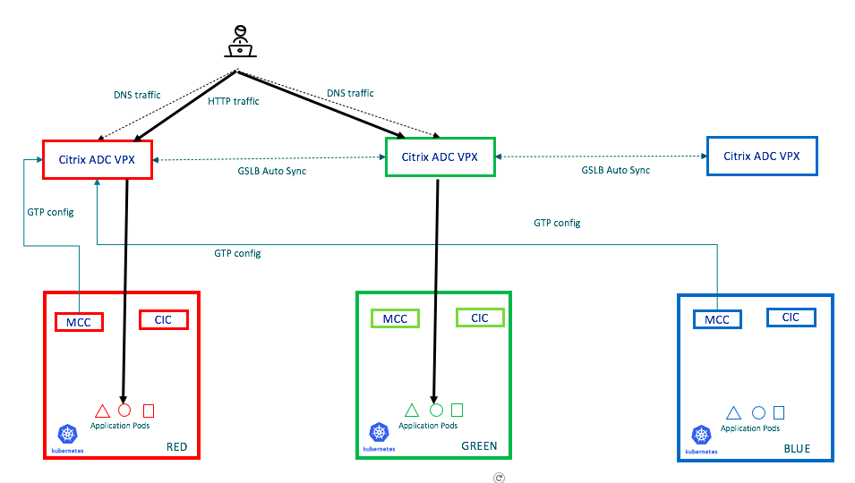
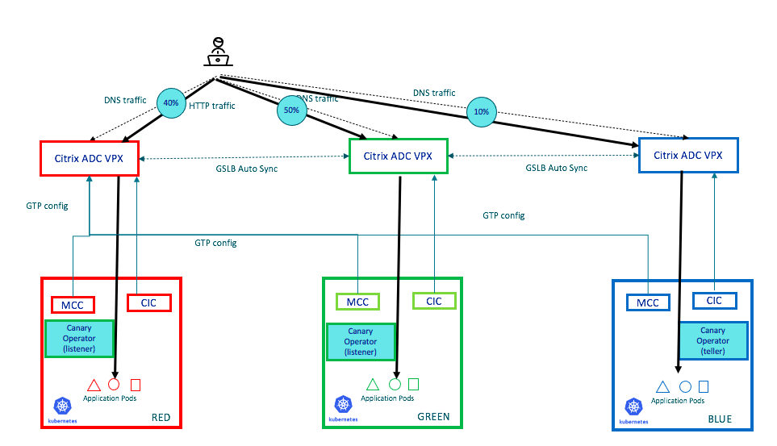

# citrix-canary-operator-using-multicluster-CRDs
This will build a canary operator on top of Citrix multicluster GSLB based CRDs which help divert traffic from one Cluster to another.

## Description
Citrix multi-cluster ingress solution helps hosting the app on multiple Kubernetes clusters. Citrix ADC GSLB technology helps in smartly redirecting the DNS traffic to most optimal Kubernetes cluster. Citrix multi-cluster ingress solution uses a Custom Resource Definition called "Global Traffic Policy"(GTP) to define multi-cluster distribution strategy. This operator which generates GTPs with different proportions to increase or decrease traffic to a specific cluster.

Let us call the cluster from which we need to phase-out an app as 'Source cluster' and the cluster to which we need to phase-in traffic for the same app as the 'destination cluster'. High level idea is like this:
- Operator will be installed in 'teller' mode in the destination-cluster. It will be waiting for canary Custom Resource Objects.
- Operator will be deployed in 'listener' mode in all remaining clusters. This will listen for any GTP (Global Traffic Policy CRD) changes in the destination cluster and apply the same in the local cluster.
- Now, apply the Canary CR object on the destination cluster. The Canary operator will read this, modify the GTP by changing the proportions of traffic distribution and reapply it. Then, the same modification will be reflected across the clusters due to listener-mode-canary-operators running in all other clusters. It waits for a certain amount of time (as dictated in the Canary CR object). It verifies counters from Citrix ADC to confirm that, lb vserver representing the app in the destination cluster is healthy and does not have any errors.
- If there are no errors, then it will continue to increase traffic percentage for the destination cluster and reduce it from the source cluster. If Health goes below a given threshold, it will rollback and retain the original GTP definition.

## What are Canary deployments?

Until about thirty years ago, coal miners used to go down to work carrying canaries with them in glass chambers such as these. Underground mines can contain potentially deadly gases such as carbon monoxide that can form during an accident such as fire or an explosion. The odorless and colorless gas is equally deadly to both humans and canaries alike, but canaries are much more susceptible to the gas, and reacts more quickly and visibly than humans do, thus alerting miners to the presence of the poisonous gas.

### Canary deployments as CICD strategy

#### Benefits
- Minimizes blast radius of new releases in production
- Gives insight into user experience from small sample of users
- Gives ability to roll-back releases if things don’t work out
- Gives Developers time to roll-out or roll-back releases carefully

#### Use cases
- New version of app with new features or bug fixes
- Infrastructure updates (upgrade of databases or operating systems or Kubernetes itself)
- Bring up new PoPor Region or Availability zones
- Bring up multi cloud or hybrid cloud setups

#### Customer scenarios

- A Customer has hosted an application in an on-prem Kubernetes cluster, now he wants to migrate that application to a Kubernetes cluster on cloud. He wants migration to be smooth and what to evaluate the build as he redirects a portion of the traffic towards this new cluster.

- A Customer hosted an app in multiple Kubernetes clusters. Now, he wants to migrate that app to the latest version of the Kubernetes cluster. He wants migration to be smooth and what to evaluate the build as he redirects a portion of the traffic towards this new cluster.

## Existing Deployment:

This solution expects an app hosted in multicluster environment, and traffic distribution is achieved through [Citrix multi-cluster ingress solution](https://developer-docs.citrix.com/projects/citrix-k8s-ingress-controller/en/latest/multicluster/multi-cluster/). Now, a customer brings up a new cluster and wants to move the traffic from one of the clusters (source cluster) to a new cluster (destination cluster).

### Example topology:
Let us consider a deployment, where an app app1 is already deployed on 2 clusters in 2 data centers, let us call them as a red cluster and a green cluster. Now, the same app app1 is brought up in a new cluster called 'blue' cluster. Now, we demonstrate how to gradually phase-out app app1 in Red data center (which will be our source cluster), and phase-in same app present in the Blue data center (this will be the destination cluster).

### Example topology diagram:

- CIC (Citrix Ingress Controller) is responsible for configuring VIP in each cluster.
- MCC (MultiCluster Controller) configures GSLB configuration across ADCs which are ADNS endpoints for app app1. they define the policy for DNS response. This is controlled by GlobalTrafficPolicies, also called GTP. Based on this a DNS response will have VIP IP of red ADC or VIP IP of GREEN ADC.
- When a user resolves hostname for app1.example.com, DNS query will end up in one of the GSLB ADCs. GSLB ADC will return the VIP of one of the clusters based on GSLB configuraiont.

## Deploy canary operator:
Deploy Canary operator in Listener mode in all existing clusters and Canary operator in the teller mode in the new cluster.

### Canary operator in listener mode.
In the listener mode, canary-operator will listen for any changes for GTP in the destination cluster and apply it back on the local cluster. For this, External_Kuubernetes_jwt_token has to be provided in the yaml, which will help this operator to listen for any GTP events happening in the destination cluster. Sample RBAC is [here](deployment/canary_rbac.yaml)
Example deployment file for canary operator in listener-mode is [here](deployment/canary_listener_operator_deployment.yaml)

### Canary operator in the teller mode.
In the teller mode, canary operator will listen for Canary CRDs and the modify GTP to tweak the percentage of traffic for source and destination clusters. Sample deployment file for this mode is [here](deployment/canary_teller_operator_deployment.yaml)

## Deploy Canary Custom Resource Definition and the instance:
Do a Kubectl apply to create a [canary](deployment/canary_crd_spec.yaml) custom resource definition in your environment.

    kubectl apply -f https://raw.githubusercontent.com/RaveendraHolla/citrix-multicluster-canary-operator/main/deployment/canary_crd_spec.yaml?token=AMHRBHXJYTYSAMTTNIC6UIK7UZHA6

Create a Canary CR instance. A sample instance is [here](deployment/canary_crd_instance.yaml). Once applied, this will move the traffic slowly from source cluster to the destination cluster and validating the build with ADC.

## Example topology diagram after installing canary operator:

## References

- Multi cluster ingress solution:
https://developer-docs.citrix.com/projects/citrix-k8s-ingress-controller/en/latest/multicluster/multi-cluster/
- Citrix cloud native solution overview:
https://www.citrix.com/products/citrix-adc/resources/microservices-app-delivery-best-practices.html
- Get started with Citrix cloud native solution with simple examples:
https://github.com/citrix/cloud-native-getting-started
- Citrix ingress controller:
https://developer-docs.citrix.com/projects/citrix-k8s-ingress-controller/en/latest/
- Citrix ADC documentation:
https://docs.citrix.com/en-us/citrix-adc/current-release.html

